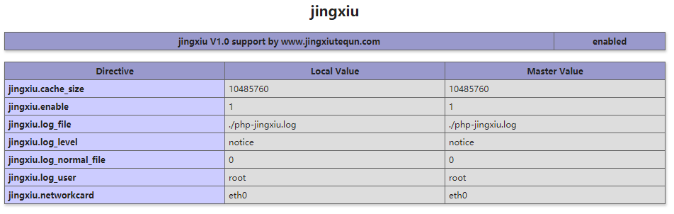

使用说明：

系统环境配置：Ubuntu 16.04.4 LTS

1.Apache 2.4
2.PHP-5.6
3.MySQL 5.5
4.Redis 5.0
注意：环境安装完毕请执行，php -m 查看是否正常有redis扩展，phpinfo()也需要查看下。

需要安装精秀插件：

1.把对应版本的jingxiu.so 复制到php的扩展目录中。
2.在php.ini 中加入extension=jingxiu.so(该文件和redis.so同目录)
3.配置完成后执行php -m 或者php运行 phpinfo()。查看是否jingxiu插件能正常加载。

一般情况下，程序环境搭建：
1.导入sql数据库。
2.修改.env 中的数据库账号密码
3.修改application/datebase.php中的账号密码。
4.给public/uploads ,runtime 配置766权限，以便于可以生成缓存文件和二维码图片等东西。
5.配置网站运行目录于public中运行。
6.进入后台：网址/gznetceo.php 默认账号密码：jingxiu / mima123 修改入口域名，中转域名，落地域名
7.填写号精秀id和精秀key获得免登陆接入，省掉一个公众号。
8.放置授权文件在public目录下,以便于网站正常运行，没有授权文件请沟通精秀特群官方人员。
9.游戏入口：网址/index.php/index/游戏代号(如币圈为biquan)
7.自行对接入款平台，积分保存在user表中的point字段中。amount为佣金字段。
8.游戏收款链接一般跳转到:网址/index.php/index/pay.html?fee=1只需对该类进行开发即可对接所有的支付。收款记录于history表中

收款系统：
只需自行开发一个控制器即可 Pay.php,对user的金额存储位point进行修改即可：

Db::name('user')->where('id='.$this->auth->id)->setInc('point',2);

具体操作请看Pay.php 控制器

出款系统：

出款系统一般默认为精秀企业付款系统，需要找官方人员开户，并获得精秀支付id和key填入后台即可集成零钱到账。

